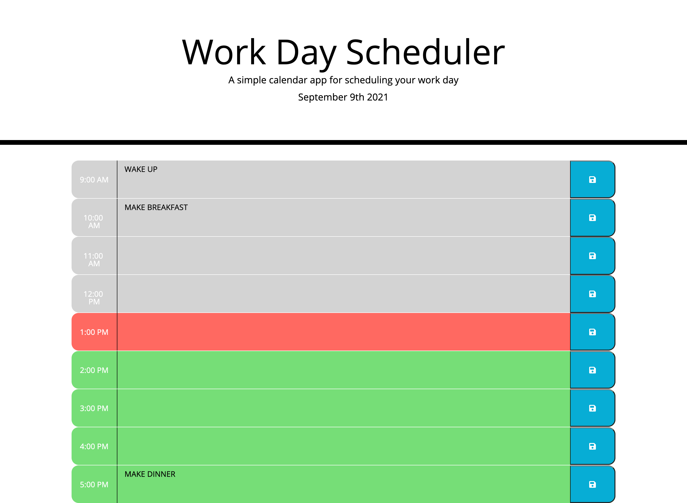

# Work Day Scheduler
  
  
  ## Description
  In this assignment, I created a work day scheduler using pre-existing HTML and CSS. Bootstrap is utilized for styling, moment.js is utilized for catpuring time and dates, and JQuery is utilized for the script. 
   
   
  As an individual with a busy work day, I wanted an app that I could log daily tasks to that would help me keep track of them as the work day progressed. 
   
   
  On this web page the user can plan their work day by adding tasks to each hour. These tasks will persist through refreshing the page or closing out and coming back to the page. As the day progress each hour block of the scheduler will change colors as the time becomes closer. Past hours are greyed out, current hour is red, and future hours are green. 
   
   
  This build taught me a lot about local storage, JQuery, and Moment.js. Using local storage to the users browser is an amazing tool to use when you are wanting data to persist, until the user clears it out. JQuery is a great way to lessen the amount of code that is required for functionality. Moment.JS is great for capturing current dates and time and is extremly useful in main different cases! 
  
  ## Table of Contents
  - [Description](#)
  - [Screencapture](#screencapture)
  - [Installation](#installation)
  - [Usage](#usage)
  - [License](#license)
  - [Credits](#credits)
  - [Links](#links)
  - [Tests](#tests)
  - [Questions](#questions)
  
  ## Screencapture
  
  

  ## Installation
  There is no installation process.
  
  ## Usage
  This app will be used to help the user plan their day by the hour. They will input their tasks for each hour of the day and as the day progresses, that hour block will change colors indicating that the hour has past, is current, or has yet to come. Data that is input will remain in that hour block until the user clears it manually.  

  ## License
  MIT
  
  ## Credits
  Konner Hartman (myself)

  ## Links
  Deployed page: 
   
  https://konnerhartman.github.io/Work_Day_Scheduler
   
   
  GitHub Repository:
   
  https://github.com/konnerhartman/Work_Day_Scheduler
  
  ## Tests
  There are no tests for this project.
  
  ## Questions
  Any questions can be directed to:
   
  Github: [konnerhartman](https://github.com/konnerhartman)
   
  Email: konner.hartman@yahoo.com